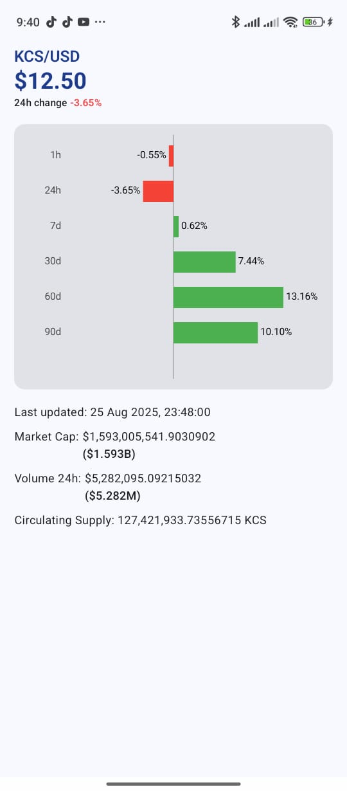

# CryptoBuddy (Android)

Simple Android sample app that demonstrates managing network requests and where to add a cache system for cryptocurrency data. The repository contains two sample images used by the UI located in the images/ folder (list.jpg and detail.jpg).

## Overview
This project is a minimal, well-structured example for fetching cryptocurrency data from a remote API, processing it, and showing it in an Android UI. It focuses on a clean networking stack and provides clear places to implement caching so the app can behave well offline and reduce API usage.

## Features
- Fetch cryptocurrency list and detail data from a REST API using Retrofit.
- OkHttp client with an Interceptor to attach API key headers.
- Dependency injection using Koin.
- Lightweight preferences using DataStore.
- ViewModels for list and detail screens.

## Tech stack
- Kotlin
- Android Jetpack (ViewModel, DataStore)
- Retrofit + OkHttp + Gson + Room
- Koin

## Project structure (high level)
- app/src/main/... : Android app sources (activities/fragments, viewmodels, layouts)
- build files and configuration at project root

## How to run
1. Open the project in Android Studio.
2. Provide any required API key (the current sample attaches the key in the Interceptor inside DI). Move keys to secure storage or BuildConfig for production.
3. Build and run on an emulator or device.

## Images (in repo)
- images/list.jpg — list screen sample image
- images/detail.jpg — detail screen sample image

<!-- Inline HTML to display images at controlled size for README viewers -->

  
  

Note: Adjust the width in the inline style to change image size. Use percentages for responsive layouts (e.g., width:48%).

## Caching (current implementation)
- The repository maintains an in-memory cache of the last fetched results and also persists those results to Room. A last-fetch timestamp is recorded via TimeProvider.
- TTL policy: cached data is considered fresh for 15 minutes. If a request arrives while the cache is fresh, the repository immediately returns the cached data without performing a network call.
- Refresh behavior: when cached data is older than 15 minutes the repository performs a network request, updates both the in-memory cache and the Room persistence layer, and updates the timestamp before returning results.
- Offline behavior: if the device is offline the repository returns persisted Room data (if available) so the UI displays the last known state; if no persisted data exists it surfaces an error or empty state.

Notes and implications
- Because data is persisted to Room, cached data survives app restarts and process termination. The in-memory cache is a fast layer backed by Room for quick reads while the app is running.
- You can change the TTL value (15 minutes) or implement more advanced invalidation strategies (per-item TTL, ETags, or server-driven Cache-Control) depending on requirements.

- This readme was generated by ChatGPT based on the provided code context.